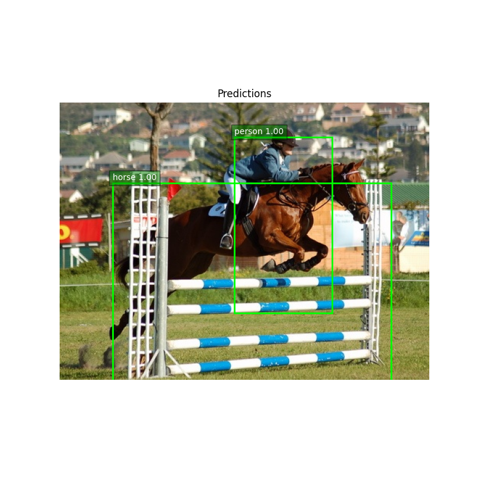
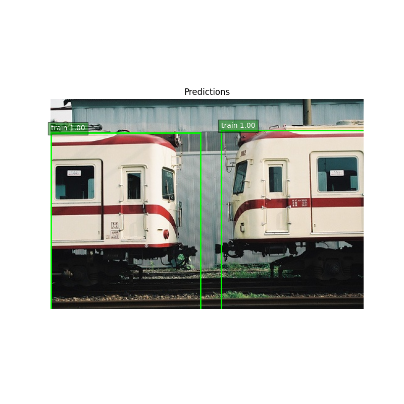
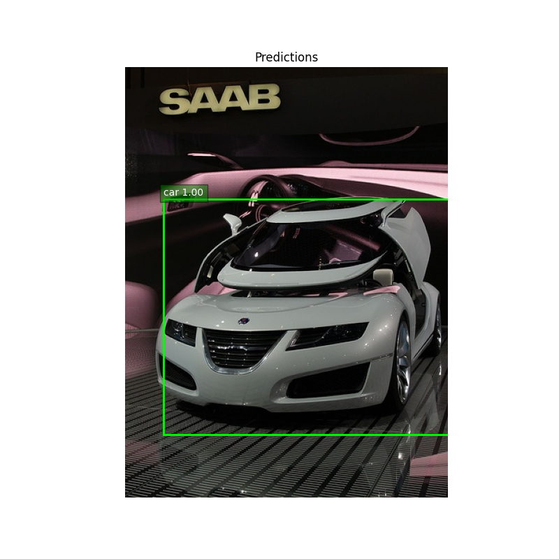
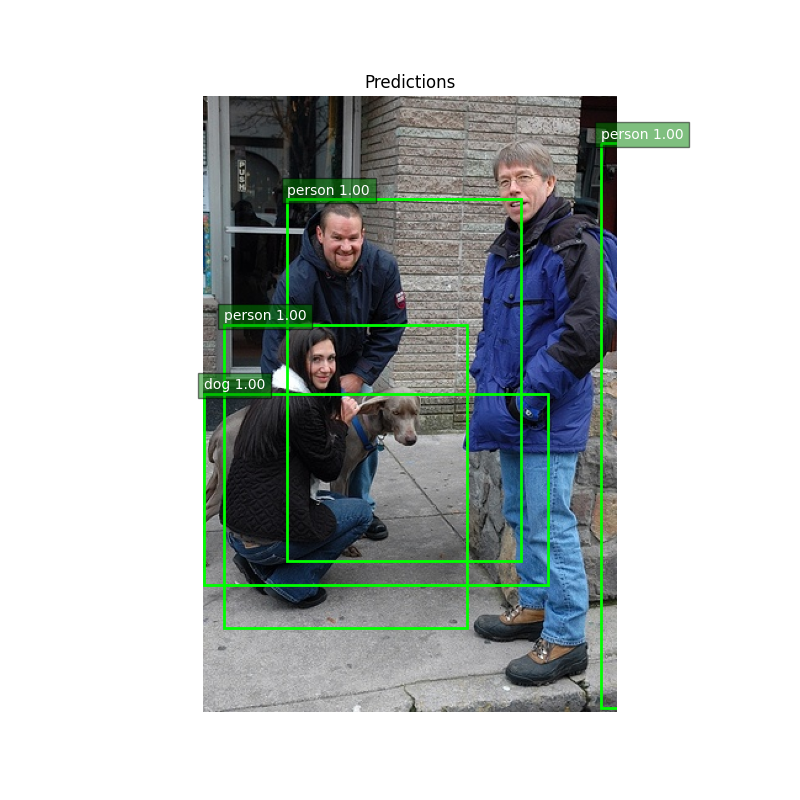

# Simple DETR (DEtection TRansformer)

A minimal and educational implementation of [DETR](https://arxiv.org/abs/2005.12872), built using PyTorch. This project recreates the core ideas behind DETR for object detection in a simple and readable way, making it suitable for learning and experimentation.

---

## 🚀 Goals

- Understand and reimplement the core ideas of DETR
- Explore transformer-based object detection
- Apply the model to Pascal VOC-style datasets
- Share a clean and working implementation for others to learn from

## 👀 What this is NOT:

- A full-fledged implementation with all bells and whistles
- A high-performance model for production use
- A replacement for the original DETR or other advanced object detectors

---

## 🧪 Overall Approach

1. Use a ResNet backbone to extract features
2. Project features & add 2D positional encoding
3. Use transformer encoder-decoder with learnable queries
4. Predict object class and bounding boxes
5. Use Hungarian matching for bipartite target assignment
6. Optimize classification and bounding box regression losses

---

## 📦 Requirements

Install dependencies with:

```bash
pip install -r requirements.txt
```

---

## 📁 Dataset

This repo uses the **Pascal VOC 2007** dataset. You can download it from:

- [VOC2007 Download Page](http://host.robots.ox.ac.uk/pascal/VOC/voc2007/)

or run `download_voc2007.py` to fetch the dataset automatically.

After downloading, convert the annotations to **YOLO format** (using `convert_voc_to_yolo_format.py` script) and place them like:

```
./VOC2007/
└── VOCdevkit/
    └── VOC2007/
        ├── JPEGImages/
        └── labels/
```

We will use the `labels` directory for training. VOC2007 has 20 object classes:

```python
VOC_CLASSES = {
    0: 'aeroplane', 1: 'bicycle', 2: 'bird', 3: 'boat', 4: 'bottle',
    5: 'bus', 6: 'car', 7: 'cat', 8: 'chair', 9: 'cow',
    10: 'diningtable', 11: 'dog', 12: 'horse', 13: 'motorbike', 14: 'person',
    15: 'pottedplant', 16: 'sheep', 17: 'sofa', 18: 'train', 19: 'tvmonitor'
}
```

## 🤸‍♂️ Training

To train the model, run the `train.py` script. You can adjust hyperparameters, model configuration, and training settings as needed.

```bash
python train.py
```

---

## 🔍 Inference

For inference, modify and run `inference.py` script as needed. You can adjust the model checkpoint, input image, and output directory.

<div style="display: flex; flex-wrap: wrap; justify-content: center; width: 75%; margin: auto;">

  <div style="flex: 1 0 45%; margin: 10px;">
    
  </div>

  <div style="flex: 1 0 45%; margin: 10px;">
    
  </div>

  <div style="flex: 1 0 45%; margin: 10px;">
    
  </div>

  <div style="flex: 1 0 45%; margin: 10px;">
    
  </div>

</div>


## 📌 Notes and Observations
    
- **Model works well for simple scenes** with few objects.
- **Performance drops for crowded scenes**.
- You can tweak transformer layers, query count, backbone, or loss weights for better results.

I would like feedback on how to improve the model for better performance and generalization specifically for crowded scenes. Or to help explain the behavior of the model in such cases. Feel free to open an issue or PR.

---

## 📚 Acknowledgements

Inspired by the original [DETR paper](https://arxiv.org/abs/2005.12872) and its [official implementation](https://github.com/facebookresearch/detectron2).


